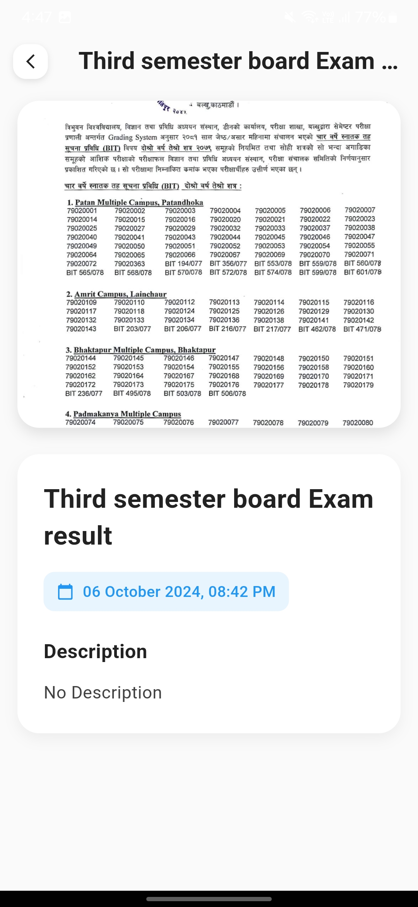
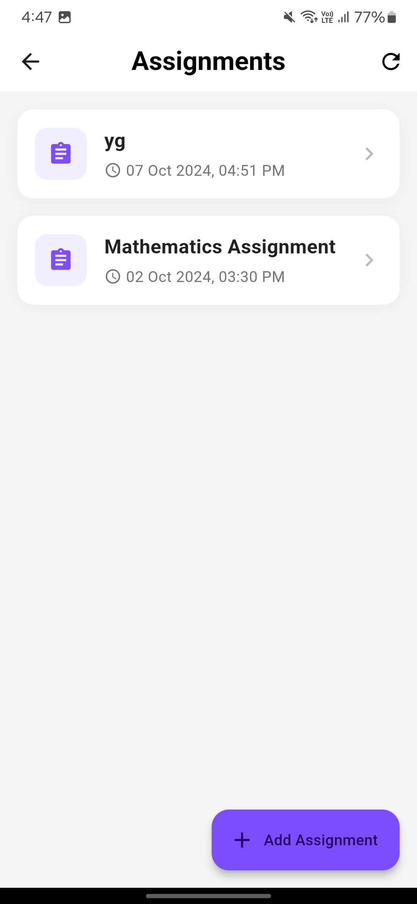

# College Companion App

## 🎓 Project Overview

### Purpose
The College Companion App is a comprehensive mobile application designed to revolutionize academic resource management and communication for college students and administrators. By leveraging cutting-edge technologies like Flutter, Firebase, and Google Gemini AI, the app provides a seamless, intelligent platform for academic engagement.


### UI of the app








### Key Objectives
- Centralize academic resources
- Enhance student-institution communication
- Provide AI-powered academic assistance
- Streamline administrative processes
- Improve student engagement and accessibility

## 🚀 Features and Modules

### 1. Authentication System
#### Authentication Methods
- **Email Login**: Standard email-based authentication
- **Biometric Authentication**:
    - Fingerprint login
    - Enhanced security with device-level biometric verification
- **Role-Based Access Control**:
    - Separate interfaces for students and administrators
    - Granular permission management

#### Security Mechanisms
- Multi-factor authentication
- Encrypted credential storage
- Secure Firebase Authentication backend
- OAuth 2.0 compliant

### 2. Resource Management
#### Notes Repository
- **Semester-wise Organization**
    - Hierarchical folder structure
    - Easy navigation between semesters
- **Subject-wise Categorization**
    - Detailed subject-level resource segmentation
    - Quick search and filter capabilities

#### Syllabus Section
- Complete curriculum details
- Downloadable syllabus documents
- Real-time syllabus updates
- Comparison between current and previous curricula

#### Past Year Question Papers
- Comprehensive question paper archive
- Filterable by:
    - Semester
    - Subject
    - Year
    - Exam type
- PDF and image support

### 3. Gemini AI Integration
#### Intelligent Chat Assistant
- **Text-based Interactions**
    - Academic doubt resolution
    - Study material explanations
    - Research assistance
- **Attachment Support**
    - Image-based query processing
    - Document analysis
    - Formula and diagram interpretation

#### AI Capabilities
- Natural language processing
- Contextual understanding
- Multilingual support
- Adaptive learning responses

### 4. Assignment Management
- **Assignment Creation**
    - Teacher-initiated assignments
    - Detailed submission guidelines
- **Student Submission**
    - Multiple file format support
    - Deadline tracking
    - Automatic late submission flags
- **Feedback Mechanism**
    - Instant teacher feedback
    - Grade and comments integration

### 5. Result Management
- **Comprehensive Result Tracking**
    - Semester-wise grade display
    - Cumulative performance metrics
- **Academic Analytics**
    - Graphical performance representation
    - Comparative analysis
    - Progression tracking
- **Detailed Breakdowns**
    - Subject-level performance
    - Credit system visualization

### 6. Event Management
#### Upcoming Events Module
- **Event Types**
    - Academic conferences
    - Workshops
    - Cultural programs
    - Sports events
- **Notification System**
    - Push notifications
    - Customizable alert preferences
    - Calendar integration

## 🔧 Technical Architecture

### Frontend
- **Framework**: Flutter
- **State Management**: Provider/Riverpod
- **UI Components**: Material Design
- **Responsive Design**: Adaptive layouts

### Backend
- **Cloud Platform**: Firebase
    - **Authentication**: Firebase Auth
    - **Database**: Firestore
    - **Storage**: Cloud Storage
    - **Cloud Functions**: Serverless backend logic
- **Real-time Synchronization**
- **Offline Support**

### AI Integration
- **Model**: Google Gemini
- **Integration Methods**:
    - REST API
    - Gemini Pro models
    - Multimodal capabilities

### Performance Optimization
- Efficient caching mechanisms
- Lazy loading of resources
- Minimal battery consumption
- Bandwidth-friendly design

## 🛠️ Development Setup

### Prerequisites
- Flutter SDK (3.10+)
- Dart SDK
- Android Studio / VS Code
- Firebase Account
- Google Cloud Project
- Gemini API Credentials

### Installation Steps
1. Clone Repository
   ```bash
   git clone https://github.com/your-org/college-companion-app.git
   cd college-companion-app
   ```

2. Install Dependencies
   ```bash
   flutter pub get
   ```

3. Firebase Configuration
- Create Firebase project
- Generate configuration files
- Update `google-services.json`

4. Environment Setup
- Configure API keys
- Set up Firebase emulators
- Prepare development environment

### Running the App
```bash
flutter run
```

## 🔒 Security Considerations
- End-to-end encryption
- Regular security audits
- GDPR and CCPA compliance
- Secure data transmission protocols

## 📦 Deployment
- Play Store deployment
- App Store submission
- Enterprise distribution channels

## 🤝 Contributing Guidelines
1. Fork Repository
2. Create Feature Branch
3. Commit Changes
4. Push to Branch
5. Create Pull Request
6. Code Review Process

## 📄 Licensing
- MIT License
- Open-source collaboration
- Commercial usage allowed

## 📞 Support and Contact
- Developer: [Your Name]
- Email: thakuriumesh919@gmail.com
- Support Discord: [Discord Invite Link]

## 🚧 Roadmap
- Enhanced AI capabilities
- Offline mode improvements
- More comprehensive analytics
- Cross-platform optimization

## 📊 Version
**Current Version**: 1.0.0
**Last Updated**: [Current Date]